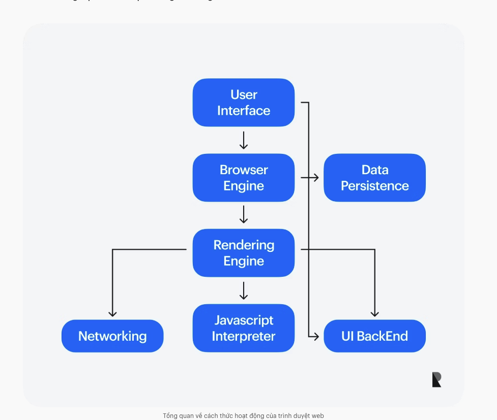

# Introduction — Các khái niệm nền tảng Web

> Báo cáo tìm hiểu (yêu cầu: 500 chữ trở lên).

## 1. Internet

**Internet là gì?**

Internet là "mạng lưới của các mạng lưới" (network of networks). Trong đó, một *mạng lưới* (network) là một nhóm các máy tính và thiết bị được kết nối với nhau. Internet chính là tập hợp của rất nhiều mạng lưới như vậy kết nối lại với nhau trên phạm vi toàn cầu.

**Cách thức hoạt động**

Internet hoạt động bằng cách kết nối các thiết bị và hệ thống máy tính với nhau thông qua một bộ giao thức tiêu chuẩn (protocol). Bộ giao thức này xác định cách các thiết bị trao đổi thông tin, đồng thời đảm bảo dữ liệu được truyền tải một cách đáng tin cậy và an toàn. Hai giao thức quan trọng nhất là **IP** và **TCP**:

- **IP (Internet Protocol):** chịu trách nhiệm định tuyến (routing) — đưa các gói dữ liệu (packet) đi đến đúng địa chỉ đích. Mỗi thiết bị trên Internet có một địa chỉ IP riêng để nhận diện.
- **TCP (Transmission Control Protocol):** đảm bảo các gói dữ liệu được truyền một cách đáng tin cậy và đúng thứ tự. Nếu một gói bị thất lạc, TCP sẽ yêu cầu gửi lại.

Ngoài ra còn có các giao thức khác:

- **DNS (Domain Name System):** hệ thống tên miền, giúp dịch tên miền (ví dụ `google.com`) sang địa chỉ IP mà máy tính hiểu được.
- **HTTP (HyperText Transfer Protocol):** giao thức truyền tải siêu văn bản, dùng để trình duyệt và máy chủ web trao đổi dữ liệu (trang web, hình ảnh...).
- **SSL/TLS (Secure Sockets Layer / Transport Layer Security):** là các giao thức **mã hóa** dữ liệu khi truyền trên Internet. SSL là phiên bản cũ, ngày nay đã được thay thế bằng TLS (mới và an toàn hơn). Khi thấy ổ khóa và `https://` trên trình duyệt, nghĩa là kết nối đang được TLS bảo vệ: dữ liệu (mật khẩu, thông tin thẻ...) được mã hóa nên kẻ khác có chặn được cũng không đọc được nội dung.

**Một số khái niệm cơ bản cần nhớ**

- **Gói dữ liệu (packet):** đơn vị dữ liệu nhỏ được truyền tải qua Internet. Một file lớn sẽ được chia thành nhiều gói nhỏ để gửi đi, rồi ghép lại ở đầu nhận.
- **Bộ định tuyến (router):** thiết bị giúp điều hướng các gói dữ liệu giữa các mạng khác nhau, để gói đi đúng đường tới đích.
- **Địa chỉ IP (IP address):** một mã định danh duy nhất được gán cho mỗi thiết bị trên mạng, dùng để định tuyến dữ liệu đến đúng đích.
- **Tên miền (domain name):** một cái tên dễ đọc với con người, dùng thay cho địa chỉ IP khó nhớ, để nhận dạng trang web — ví dụ `google.com`.
- **DNS (Domain Name System):** hệ thống tên miền, chịu trách nhiệm dịch **tên miền → địa chỉ IP** (và ngược lại). Nhờ DNS mà ta chỉ cần nhớ `google.com` thay vì một dãy số IP.
- **HTTP (HyperText Transfer Protocol):** giao thức truyền tải siêu văn bản, dùng để truyền dữ liệu giữa máy khách (client) và máy chủ (server).
- **HTTPS:** phiên bản có mã hóa của HTTP, cung cấp khả năng liên lạc an toàn giữa máy khách và máy chủ (HTTP + SSL/TLS).

## 2. HTTP

**HTTP là gì?**

HTTP (HyperText Transfer Protocol) là giao thức truyền tải siêu văn bản của mạng lưới toàn cầu (Internet), được dùng để tải các trang web thông qua các **liên kết siêu văn bản**.

> *Liên kết siêu văn bản (hyperlink) là gì?* Là đoạn văn bản hoặc hình ảnh mà khi bấm vào sẽ dẫn ta tới một trang/tài nguyên khác — chính là các "link" ta bấm hằng ngày. "Siêu văn bản" (hypertext) là loại văn bản có chứa các liên kết như vậy, thay vì chỉ là văn bản phẳng đọc từ trên xuống.

**HTTP method (phương thức HTTP) là gì?**

HTTP method — đôi khi gọi là "động từ HTTP" (HTTP verb) — cho biết một yêu cầu (request) HTTP **mong muốn máy chủ làm gì**. Hai phương thức phổ biến nhất là **GET** và **POST**:

- **GET:** dùng để **lấy/nhận thông tin** từ máy chủ (ví dụ: tải về nội dung một trang web). Khi bạn gõ một địa chỉ web vào trình duyệt và Enter, trình duyệt gửi một request GET tới máy chủ.
  > *"Nhận lại thông tin ở dạng địa chỉ trang web" nghĩa là sao?* Ý là: GET dùng để **yêu cầu nội dung của một địa chỉ (URL)** cụ thể. Tham số của GET cũng được gắn ngay trên URL (ví dụ `google.com/search?q=http`), nên GET thường gắn liền với "địa chỉ trang web".
- **POST:** dùng khi máy khách (client) muốn **gửi thông tin lên** máy chủ — ví dụ: gửi form đăng nhập, đăng một bình luận, tải file lên.

**HTTP request header là gì?**

Header là phần thông tin **mô tả** đi kèm trong mỗi request HTTP, tồn tại dưới dạng các **cặp khóa–giá trị** (key: value). Nó giúp máy khách và máy chủ "giao tiếp" với nhau về bối cảnh của yêu cầu — tức là gửi kèm các *thông tin lõi (core info)* như: trình duyệt nào đang gửi, dữ liệu nào đang được yêu cầu, ngôn ngữ ưu tiên... Một vài header/thuộc tính thường gặp:

- **User-Agent:** cho biết trình duyệt/thiết bị nào đang gửi yêu cầu (ví dụ Chrome trên Windows).
- **Accept-Language:** ngôn ngữ mà người dùng ưu tiên nhận về (ví dụ `vi`, `en`).
- **Host / Authority:** tên miền (máy chủ) mà yêu cầu đang nhắm tới, ví dụ `google.com`.
- **Path:** đường dẫn tới tài nguyên cụ thể trên máy chủ đó, ví dụ `/search`.
- **Scheme:** giao thức được dùng, thường là `http` hoặc `https`.
- **Method:** phương thức của yêu cầu (GET, POST...).

**HTTP body (phần thân) là gì?**

HTTP body gồm toàn bộ **nội dung thực sự** mà yêu cầu đang truyền tải — ví dụ như tên người dùng và mật khẩu, hoặc bất kỳ dữ liệu nào khác được nhập vào biểu mẫu (form). Khác với header (chỉ *mô tả* về yêu cầu), body chứa **dữ liệu chính** cần gửi đi. Các request POST thường có body (mang dữ liệu form), còn request GET thường không có body.

**HTTP response (phản hồi) là gì?**

Sau khi máy chủ nhận request, nó trả về một **response**. Một HTTP response bao gồm:

- **Status code (mã trạng thái):** con số 3 chữ số cho biết kết quả của yêu cầu, được chia thành các nhóm:
  - **2xx — thành công:** ví dụ `200 OK` (yêu cầu thành công).
  - **3xx — chuyển hướng:** ví dụ `301`, `302` (tài nguyên đã chuyển sang địa chỉ khác).
  - **4xx — lỗi từ phía client:** ví dụ `404 Not Found` (không tìm thấy trang).
  - **5xx — lỗi từ phía server:** ví dụ `500 Internal Server Error` (máy chủ gặp lỗi).
- **Header:** các cặp khóa–giá trị mô tả phản hồi (ví dụ: kiểu nội dung trả về, độ dài, thời gian...).
- **Body (tùy chọn):** nội dung thực sự được trả về cho máy khách — ví dụ mã HTML của trang web, hình ảnh, hoặc dữ liệu JSON. Gọi là "tùy chọn" vì có những phản hồi không cần body (ví dụ chỉ báo chuyển hướng).

**HTTPS khác gì HTTP?**

HTTPS là HTTP có thêm lớp mã hóa **SSL/TLS**. Nội dung trao đổi được mã hóa nên an toàn hơn (chống nghe lén, giả mạo). Ngày nay hầu hết website đều dùng HTTPS.


## 3. Domain Name (Tên miền)

Tên miền là một phần quan trọng của cơ sở hạ tầng Internet. Nó cung cấp một địa chỉ **dễ đọc với con người** cho các máy chủ web có sẵn trên Internet.

Bất kỳ máy tính nào kết nối Internet đều được truy cập thông qua một **địa chỉ IP công cộng** (như IPv4 hoặc IPv6). Tuy nhiên, máy tính thì dễ nhớ những dãy số này, còn con người thì không. Ngoài ra, địa chỉ IP còn có thể **thay đổi** theo thời gian. Vì vậy, chúng ta cần **tên miền** — một cái tên cố định, dễ nhớ, đại diện cho máy chủ thay cho địa chỉ IP.

**Cấu trúc tên miền**

Một tên miền có dạng: `label2.label1.TLD` (đọc từ phải sang trái theo cấp độ). Ví dụ `developer.mozilla.org`:

- **TLD** (viết tắt của **Top-Level Domain** — tên miền cấp cao nhất): là phần ngoài cùng bên phải, thường phản ánh **mục đích chung** hoặc lĩnh vực của dịch vụ. Ví dụ: `.edu` cho giáo dục, `.gov` cho chính phủ, `.org` cho tổ chức, `.com` cho thương mại, hoặc theo quốc gia như `.vn`.
- **label1** (tên miền cấp 2 / SLD): tên riêng do tổ chức chọn, ví dụ `mozilla`.
- **label2** (subdomain — tên miền phụ): phần đứng trước, ví dụ `developer`.

**Mua hay thuê tên miền?**

Thực ra bạn **không thể "mua đứt"** một tên miền — bạn chỉ **trả tiền để thuê** quyền sử dụng nó trong một khoảng thời gian (theo năm), và phải gia hạn để tiếp tục giữ.

Để kiểm tra một tên miền còn khả dụng (chưa ai thuê) hay không, có thể dùng lệnh/dịch vụ **WHOIS**. Ví dụ:

```bash
whois mozilla.org
```

Lệnh này trả về thông tin đăng ký của tên miền (ai đang sở hữu, ngày hết hạn...). Nếu chưa có ai đăng ký, tên miền đó còn trống để thuê.


## 4. Hosting

**Hosting là gì?**

Hosting (web hosting) là dịch vụ cho thuê chỗ lưu trữ website trên một máy chủ (server) luôn bật và luôn kết nối Internet, để bất kỳ ai cũng có thể truy cập trang web của bạn 24/7.

**Vì sao cần hosting?**

Khi bạn làm xong một website (gồm các file HTML, ảnh, code, cơ sở dữ liệu...), các file đó đang nằm trên máy tính cá nhân của bạn. Nhưng máy bạn không thể bật 24/24 và không có địa chỉ cố định để người khác vào. Hosting giải quyết điều đó: bạn đưa (upload) file web lên máy chủ của nhà cung cấp → máy chủ đó luôn online → mọi người truy cập được mọi lúc.

**Các loại hosting thường gặp**

- **Shared hosting (lưu trữ chia sẻ):** nhiều website cùng dùng chung tài nguyên của một máy chủ. Giá rẻ, dễ sử dụng, phù hợp với website nhỏ hoặc mới bắt đầu. Nhược điểm: bị giới hạn tài nguyên và ảnh hưởng lẫn nhau giữa các web chung server.
- **VPS (Virtual Private Server — máy chủ ảo riêng):** một máy chủ vật lý được chia thành nhiều máy chủ ảo, mỗi VPS có tài nguyên (CPU, RAM, ổ cứng) riêng. Mạnh và linh hoạt hơn shared hosting, toàn quyền cài đặt phần mềm.
- **Dedicated server (máy chủ riêng):** thuê nguyên một máy chủ vật lý cho riêng mình. Mạnh nhất, toàn quyền sử dụng, nhưng chi phí cao nhất — phù hợp với website lớn, lượng truy cập cao.
- **Cloud hosting (lưu trữ đám mây):** website được vận hành trên nhiều máy chủ liên kết với nhau theo mô hình "đám mây". Ưu điểm là dễ **mở rộng (scale)** linh hoạt và ổn định cao (một server lỗi vẫn có server khác gánh).


## 5. DNS

DNS (Domain Name System) là hệ thống chịu trách nhiệm dịch **tên miền → địa chỉ IP**, giúp con người chỉ cần nhớ tên miền thay vì dãy số IP.

**Yêu cầu DNS hoạt động như thế nào?**

Như thấy, khi muốn hiển thị một trang web trong trình duyệt, việc nhập tên miền dễ hơn nhiều so với nhập địa chỉ IP. quy trình:

1. Nhập `mozilla.org` vào thanh địa chỉ của trình duyệt.
2. Trình duyệt sẽ hỏi máy tính của bạn xem nó đã biết địa chỉ IP ứng với tên miền này chưa (kiểm tra **bộ nhớ đệm DNS cục bộ** — local DNS cache).
3. Nếu **có** trong cache: tên miền được chuyển đổi ngay thành địa chỉ IP, và trình duyệt bắt đầu trao đổi (đàm phán) nội dung với máy chủ web. Xong.
4. Nếu **chưa có**: máy tính sẽ đi hỏi các **máy chủ DNS** (DNS server) trên Internet để tra ra địa chỉ IP, rồi lưu lại vào cache cho những lần sau.


## 6. Browser (Trình duyệt)

**Trình duyệt web là gì?**

Trình duyệt web là một chương trình phần mềm cho phép người dùng truy cập thông tin trên Internet thông qua Mạng lưới toàn cầu (World Wide Web). Do đó, trình duyệt web đóng vai trò như những cánh cổng, cho phép mọi người tương tác với doanh nghiệp và những người khác thông qua mạng Internet toàn cầu. Trình duyệt web cung cấp cho bạn quyền truy cập vào tất cả các nền tảng có sẵn trên Internet, cho phép bạn xem văn bản, hình ảnh và video trên toàn thế giới.

Bằng cách nhập URL vào thanh địa chỉ, bạn hướng trình duyệt web của mình đến một máy chủ web cụ thể. Trình duyệt sẽ truy cập máy chủ đó, lấy thông tin được yêu cầu và hiển thị nó dưới dạng một trang web.

**Làm rõ một vài khái niệm**

- **URL (Uniform Resource Locator):** là *địa chỉ đầy đủ* của một tài nguyên trên web, không chỉ là tên miền. Ví dụ `https://developer.mozilla.org/vi/docs` gồm: scheme (`https`) + tên miền (`developer.mozilla.org`) + đường dẫn (`/vi/docs`). Trong đó **chỉ phần tên miền** mới được DNS dịch sang địa chỉ IP của máy chủ, các phần còn lại cho máy chủ biết *lấy tài nguyên nào*.
- **Máy chủ web (web server):** là một **máy tính** (vật lý hoặc ảo) chạy phần mềm phục vụ web, luôn online để trả về nội dung khi có yêu cầu. **Địa chỉ IP không *phải là* máy chủ — IP chỉ là "địa chỉ nhà" để tìm tới máy chủ đó.** Nói cách khác: tên miền → (DNS) → địa chỉ IP → dẫn tới đúng máy chủ web cần truy cập.

**Trình duyệt web hoạt động như thế nào?**

Bên trong, trình duyệt chuyển đổi các thuật ngữ kỹ thuật phức tạp thành trải nghiệm thân thiện với người dùng. Một trình duyệt thường gồm các thành phần chính sau:

- **User Interface (Giao diện người dùng):** phần ta nhìn thấy và thao tác — thanh địa chỉ, nút back/forward, bookmark... (tất cả trừ vùng hiển thị nội dung trang).
- **Browser Engine (Bộ máy trình duyệt):** cầu nối điều phối giữa giao diện người dùng và bộ máy hiển thị (rendering engine).
- **Rendering Engine (Bộ máy hiển thị):** chịu trách nhiệm "vẽ" nội dung — phân tích HTML, CSS và hiển thị trang web lên màn hình.
- **Networking (Mạng):** xử lý các yêu cầu mạng như HTTP/HTTPS để tải tài nguyên (HTML, ảnh...) từ máy chủ về.
- **JavaScript Interpreter (Bộ thông dịch JavaScript):** đọc và thực thi mã JavaScript của trang web, tạo ra tính tương tác.
- **UI Backend:** dùng để vẽ các thành phần giao diện cơ bản như hộp chọn (combo box), cửa sổ... (gọi xuống các hàm vẽ của hệ điều hành).
- **Data Persistence (Lưu trữ dữ liệu):** nơi trình duyệt lưu dữ liệu cục bộ như cookie, cache, localStorage để dùng lại cho những lần truy cập sau.

Tóm tắt luồng hoạt động: người dùng nhập URL ở **User Interface** → **Browser Engine** điều phối → **Networking** tải dữ liệu từ máy chủ về → **Rendering Engine** phân tích HTML/CSS (và nhờ **JavaScript Interpreter** chạy JS) → hiển thị trang hoàn chỉnh ra màn hình.




---
### Nguồn tham khảo
<!-- Liệt kê các link/tài liệu đã đọc -->
