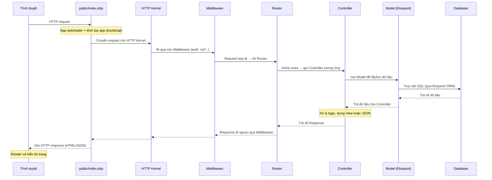

# Laravel — Vòng đời một Request (Request Lifecycle)

> Sơ đồ và ghi chú về cách Laravel xử lý một yêu cầu từ trình duyệt.

## Sơ đồ tuần tự (Sequence Diagram)

## Giải thích các bước

1. **public/index.php** — điểm vào (entry point) duy nhất của ứng dụng. Mọi request đều đi qua đây. Nó nạp **Composer autoloader** và khởi tạo (bootstrap) ứng dụng Laravel.
2. **HTTP Kernel** — "bộ não" tiếp nhận request. Nó nạp các cấu hình, đăng ký **service provider**, rồi đẩy request qua lớp middleware.
3. **Middleware** — các "lớp lọc" mà request phải đi qua trước khi tới logic chính, ví dụ: kiểm tra đăng nhập (auth), chống CSRF, ghi log... Request không hợp lệ sẽ bị chặn tại đây.
4. **Router** — so khớp URL của request với các route đã định nghĩa (trong `routes/web.php` hoặc `routes/api.php`), rồi chuyển tới Controller (hoặc closure) tương ứng.
5. **Controller** — chứa logic xử lý: nhận dữ liệu, gọi Model, quyết định trả về gì.
6. **Model (Eloquent ORM)** — đại diện cho bảng trong cơ sở dữ liệu. Thay vì viết SQL thủ công, ta thao tác với dữ liệu qua các đối tượng PHP; Eloquent tự sinh câu lệnh SQL.
7. **Database** — nơi lưu trữ dữ liệu thực sự (MySQL, PostgreSQL...).
8. **Response** — Controller dựng kết quả thành **View (HTML)** hoặc **JSON** (cho API), rồi response đi **ngược lại** qua middleware → Kernel → index.php → trả về trình duyệt.

> **Tóm tắt:** Request → index.php → Kernel → Middleware → Router → Controller → Model → Database, rồi đi ngược lại để trả Response về cho trình duyệt. Laravel dùng mô hình **MVC** (Model – View – Controller) để tách bạch dữ liệu, giao diện và logic điều khiển.

---
### Nguồn tham khảo
<!-- Liệt kê các link/tài liệu đã đọc -->
