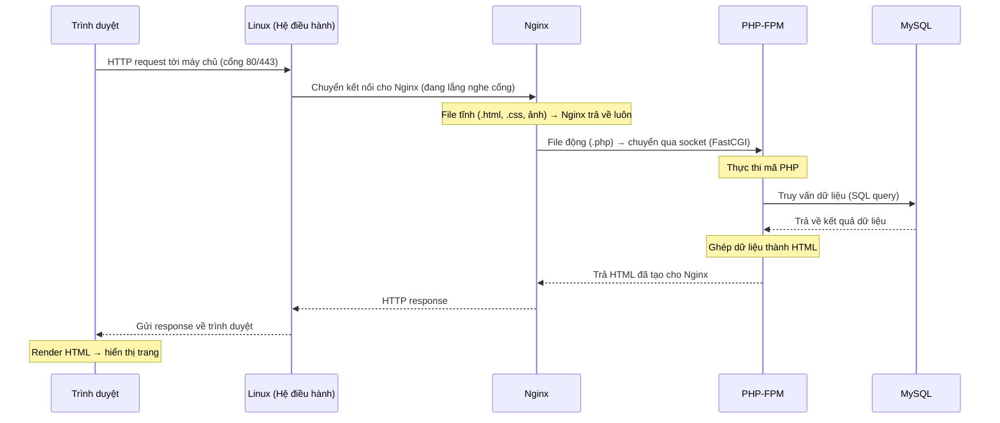

# LEMP Stack — Hướng dẫn cài đặt & Ghi chú

> Báo cáo các bước cài đặt LEMP stack (yêu cầu: 500 chữ trở lên).

## Các bước cài đặt LEMP Stack

Hướng dẫn dưới đây thực hiện trên hệ điều hành **Ubuntu** (các bản Debian-based tương tự).

### Bước 1 — Cập nhật hệ thống

Trước khi cài đặt, nên cập nhật danh sách gói và nâng cấp các gói hiện có để tránh xung đột phiên bản:

```bash
sudo apt update && sudo apt upgrade -y
```

### Bước 2 — Cài đặt Nginx

Nginx đóng vai trò web server (xử lý các yêu cầu HTTP từ trình duyệt):

```bash
sudo apt install nginx -y
sudo systemctl enable nginx      # tự chạy khi khởi động máy
sudo systemctl start nginx       # khởi động dịch vụ
sudo systemctl status nginx      # kiểm tra trạng thái
```

Nếu dùng tường lửa `ufw`, mở cổng cho web:

```bash
sudo ufw allow 'Nginx Full'      # mở cổng 80 (HTTP) và 443 (HTTPS)
```

Mở trình duyệt và truy cập `http://địa-chỉ-IP-server`, nếu thấy trang "Welcome to nginx!" là đã thành công.

### Bước 3 — Cài đặt MySQL (hoặc MariaDB)

MySQL là hệ quản trị cơ sở dữ liệu để lưu trữ dữ liệu cho website:

```bash
sudo apt install mysql-server -y
sudo mysql_secure_installation   # thiết lập bảo mật: đặt mật khẩu root, xóa user ẩn danh...
```

### Bước 4 — Cài đặt PHP (PHP-FPM)

Khác với Apache (nhúng sẵn module PHP), Nginx không tự xử lý PHP mà phải thông qua **PHP-FPM** (FastCGI Process Manager). Ta cài PHP-FPM cùng module kết nối MySQL:

```bash
sudo apt install php-fpm php-mysql -y
```

### Bước 5 — Cấu hình Nginx chạy PHP

Tạo (hoặc sửa) một **server block** để Nginx biết cách chuyển các file `.php` cho PHP-FPM xử lý. Mở file cấu hình, ví dụ `/etc/nginx/sites-available/your_site`:

```nginx
server {
    listen 80;
    server_name your_domain hoặc IP;
    root /var/www/your_site;
    index index.php index.html;

    location / {
        try_files $uri $uri/ =404;
    }

    location ~ \.php$ {
        include snippets/fastcgi-php.conf;
        fastcgi_pass unix:/run/php/php-fpm.sock;   # trỏ tới socket của PHP-FPM
    }
}
```

Kích hoạt cấu hình, kiểm tra cú pháp rồi tải lại Nginx:

```bash
sudo ln -s /etc/nginx/sites-available/your_site /etc/nginx/sites-enabled/
sudo nginx -t          # kiểm tra cú pháp cấu hình
sudo systemctl reload nginx
```

### Bước 6 — Kiểm tra hoạt động

Tạo một file PHP để kiểm tra PHP-FPM đã hoạt động:

```bash
echo "<?php phpinfo(); ?>" | sudo tee /var/www/your_site/info.php
```

Truy cập `http://địa-chỉ-server/info.php` — nếu hiện bảng thông tin PHP là toàn bộ LEMP stack đã chạy đúng. **Lưu ý:** xóa file `info.php` sau khi test vì nó để lộ thông tin hệ thống.

---

## 1. LEMP stack là gì?

**LEMP** là tên viết tắt của một bộ phần mềm mã nguồn mở thường dùng để vận hành các website và ứng dụng web động:

- **L — Linux:** hệ điều hành nền tảng cho máy chủ.
- **E — (E)Nginx:** web server (chữ "E" lấy theo cách đọc "Engine-X" của Nginx).
- **M — MySQL / MariaDB:** hệ quản trị cơ sở dữ liệu, nơi lưu trữ dữ liệu.
- **P — PHP:** ngôn ngữ lập trình xử lý logic phía máy chủ (cũng có thể là Perl/Python).

LEMP là biến thể của **LAMP**, chỉ khác ở chỗ thay web server **Apache** bằng **Nginx**. Bộ này phối hợp với nhau để: Nginx nhận yêu cầu từ trình duyệt → chuyển phần xử lý động cho PHP → PHP truy vấn dữ liệu từ MySQL → trả kết quả về cho người dùng.

**Luồng xử lý một request trong LEMP stack**

Sơ đồ tuần tự dưới đây thể hiện các thành phần phối hợp với nhau khi có một yêu cầu trang động (`.php`):



Giải thích vai trò từng lớp:

1. **Linux** là nền tảng — nhận kết nối mạng từ trình duyệt qua cổng (80 cho HTTP, 443 cho HTTPS) và là môi trường chạy cho mọi dịch vụ bên dưới.
2. **Nginx** nhận yêu cầu. Nếu là **file tĩnh** (HTML, CSS, ảnh) thì Nginx trả về ngay. Nếu là **file động** (`.php`) thì Nginx chuyển tiếp cho PHP-FPM qua socket (FastCGI).
3. **PHP-FPM** thực thi mã PHP. Khi cần dữ liệu, nó **truy vấn MySQL**.
4. **MySQL** trả về dữ liệu cho PHP-FPM.
5. **PHP-FPM** ghép dữ liệu thành HTML hoàn chỉnh, trả ngược về **Nginx**.
6. **Nginx** gửi HTTP response qua **Linux** về **trình duyệt** để hiển thị.

## 2. Nginx — Tại sao cần tới Nginx?

Nginx (đọc là "Engine-X") là một **web server** hiệu năng cao, đồng thời có thể đóng vai trò **reverse proxy**, **load balancer** và **cache**. Lý do cần tới Nginx:

- **Phục vụ nội dung tĩnh cực nhanh:** Nginx xử lý các file tĩnh (HTML, CSS, JS, ảnh) rất hiệu quả, tốn ít tài nguyên.
- **Chịu tải cao (high concurrency):** nhờ kiến trúc **bất đồng bộ, hướng sự kiện (event-driven)**, Nginx phục vụ được hàng nghìn kết nối đồng thời mà không tốn nhiều RAM.
- **Reverse proxy / Load balancing:** Nginx đứng trước các ứng dụng (PHP-FPM, Node.js...) để nhận và phân phối yêu cầu, cân bằng tải giữa nhiều máy chủ.
- **Bảo mật & SSL:** dễ dàng cấu hình HTTPS, giới hạn truy cập, chống một số kiểu tấn công.

**Tại sao Nginx cần PHP-FPM mà Apache thì không?**

Bản thân web server chỉ giỏi **trả về file tĩnh** (HTML, ảnh, CSS). Để chạy được mã PHP (nội dung động), cần có một "bộ xử lý PHP". Sự khác biệt nằm ở cách hai web server kết nối tới bộ xử lý đó:

- **Apache:** có thể **nhúng trực tiếp** bộ xử lý PHP vào trong tiến trình của mình bằng module `mod_php`. Tức là PHP "nằm sẵn bên trong" Apache, mỗi tiến trình Apache tự biết cách chạy PHP → không cần dịch vụ riêng. (Tiện nhưng tốn RAM, vì tiến trình nào cũng phải gánh thêm PHP.)
- **Nginx:** được thiết kế **không nhúng** bất kỳ ngôn ngữ nào vào lõi, để giữ cho nó nhẹ và nhanh. Vì vậy Nginx **không tự chạy được PHP**, mà phải đẩy các yêu cầu PHP sang một dịch vụ độc lập là **PHP-FPM** (FastCGI Process Manager) thông qua giao thức **FastCGI**. PHP-FPM xử lý xong rồi trả kết quả ngược lại cho Nginx để gửi cho người dùng.

Nói ngắn gọn: Apache "ôm" PHP vào trong, còn Nginx "thuê ngoài" cho PHP-FPM. Cách tách riêng của Nginx giúp web server gọn nhẹ và mỗi thành phần được tối ưu độc lập.

**Socket của PHP-FPM là gì?**

Vì Nginx và PHP-FPM là hai chương trình tách biệt, chúng cần một "cổng giao tiếp" để trao đổi dữ liệu — đó chính là **socket**. Trong cấu hình Nginx ở trên, dòng `fastcgi_pass unix:/run/php/php-fpm.sock;` nghĩa là: *"mọi yêu cầu PHP, hãy gửi tới PHP-FPM qua socket này"*. Có 2 kiểu socket:

| Kiểu | Cú pháp | Đặc điểm |
|---|---|---|
| **Unix socket** | `unix:/run/php/php-fpm.sock` | Là một **file đặc biệt** trên ổ đĩa. Dùng khi Nginx và PHP-FPM **nằm trên cùng một máy** — nhanh hơn vì không qua mạng. |
| **TCP socket** | `127.0.0.1:9000` | Giao tiếp qua **địa chỉ IP + cổng**. Dùng khi Nginx và PHP-FPM ở **hai máy khác nhau** (hoặc trong Docker) — linh hoạt hơn nhưng chậm hơn chút. |

Hình dung đơn giản: **Unix socket** như hai người ngồi cùng một phòng đưa giấy trực tiếp cho nhau (nhanh, gọn); **TCP socket** như hai người ở hai phòng phải gọi điện thoại cho nhau (linh hoạt hơn nhưng tốn công hơn).

> **Lưu ý:** giá trị `listen` trong cấu hình PHP-FPM (`/etc/php/<phiên-bản>/fpm/pool.d/www.conf`) **phải khớp** với `fastcgi_pass` bên Nginx. Nếu hai bên không trùng (một bên dùng socket file, một bên dùng `127.0.0.1:9000`) sẽ gây lỗi **502 Bad Gateway** — lỗi rất hay gặp khi mới cài LEMP.

Để kiểm tra máy đang dùng kiểu socket nào, xem dòng `listen` của PHP-FPM:

```bash
grep "^listen" /etc/php/*/fpm/pool.d/www.conf
```

Nếu kết quả là một **đường dẫn file** (`.sock`) → đang dùng Unix socket; nếu là **IP:cổng** (ví dụ `127.0.0.1:9000`) → đang dùng TCP socket.

## 3. Nginx khác gì Apache?

Cả hai đều là web server phổ biến, nhưng khác nhau cốt lõi ở **kiến trúc xử lý kết nối**:

| Tiêu chí | Nginx | Apache |
|---|---|---|
| Kiến trúc | Event-driven, bất đồng bộ (1 tiến trình xử lý nhiều kết nối) | Process/thread (mỗi kết nối một tiến trình/luồng) |
| Nội dung tĩnh | Rất nhanh, ít tốn RAM | Chậm hơn, tốn RAM hơn khi tải cao |
| Nội dung động | Cần chuyển sang PHP-FPM | Có module nhúng sẵn (mod_php) |
| Khi tải cao | Ổn định, ít tốn tài nguyên | RAM tăng nhanh theo số kết nối |
| Cấu hình | Tập trung ở file cấu hình | Hỗ trợ `.htaccess` (cấu hình theo từng thư mục) |

Tóm lại: **Apache** linh hoạt, dễ dùng `.htaccess`, có module phong phú — phù hợp shared hosting. **Nginx** mạnh về hiệu năng và chịu tải, thường dùng làm reverse proxy hoặc cho website lượng truy cập lớn.

**Kiến trúc event-driven (hướng sự kiện) là gì?**

Đây chính là điểm cốt lõi tạo nên khác biệt về hiệu năng giữa Nginx và Apache.

- **Cách truyền thống của Apache (process/thread per connection):** mỗi kết nối của người dùng được giao cho **một tiến trình (process) hoặc luồng (thread) riêng**. Nếu có 1.000 người truy cập cùng lúc thì cần tới 1.000 tiến trình/luồng — mỗi cái chiếm một phần RAM. Khi một tiến trình đang **chờ** (ví dụ chờ đọc ổ cứng hay chờ mạng), nó vẫn "ngồi không" mà vẫn giữ tài nguyên → tốn RAM và CPU khi tải cao.

- **Cách event-driven của Nginx:** chỉ dùng **một (hoặc vài) tiến trình**, nhưng mỗi tiến trình xử lý **rất nhiều kết nối cùng lúc** theo cơ chế **bất đồng bộ (asynchronous)**. Thay vì đứng chờ một việc xong mới làm việc khác, Nginx hoạt động theo kiểu "**có sự kiện gì xảy ra thì mới xử lý cái đó**" (ví dụ: "dữ liệu đã sẵn sàng để đọc", "client đã gửi xong yêu cầu"). Trong lúc một kết nối đang chờ I/O, Nginx quay sang phục vụ các kết nối khác chứ không bị "kẹt".

Ví dụ dễ hình dung: Apache giống như **mỗi khách hàng có một nhân viên phục vụ riêng** — đông khách thì phải thuê thêm rất nhiều nhân viên. Còn Nginx giống **một nhân viên giỏi đa nhiệm**, ai cần gì thì xử lý ngay cái đó, không đứng chờ vô ích → phục vụ được nhiều khách hơn với ít nhân lực hơn. Nhờ vậy Nginx chịu tải cao (high concurrency) mà tốn ít tài nguyên.

## 4. HTTP/1 khác gì HTTP/2?

- **HTTP/1.1:** mỗi kết nối TCP xử lý **tuần tự** từng yêu cầu; muốn tải nhiều tài nguyên cùng lúc trình duyệt phải mở **nhiều kết nối song song**. Header gửi đi dưới dạng văn bản thuần, không nén, dễ lặp lại gây lãng phí.
- **HTTP/2:** cải tiến lớn về hiệu năng:
  - **Multiplexing (đa luồng):** nhiều yêu cầu/phản hồi truyền song song trên **một kết nối duy nhất**, loại bỏ tình trạng "tắc nghẽn đầu hàng" (head-of-line blocking) của HTTP/1.
  - **Nén header (HPACK):** giảm dung lượng header lặp lại.
  - **Server Push:** máy chủ có thể chủ động gửi trước tài nguyên (CSS, JS) mà nó biết client sẽ cần.
  - **Dữ liệu nhị phân:** truyền dạng nhị phân thay vì văn bản, nhanh và ít lỗi hơn.

Kết quả: HTTP/2 tải trang nhanh hơn, tiết kiệm băng thông, đặc biệt với các trang có nhiều tài nguyên.

## 5. VPS là gì, khác gì server vật lý (bare metal)?

- **Server vật lý (bare metal / dedicated server):** là **một máy chủ vật lý thật**, toàn bộ phần cứng (CPU, RAM, ổ cứng) dành riêng cho một người dùng. Hiệu năng cao nhất, toàn quyền kiểm soát, nhưng **chi phí cao**, khó nâng cấp nhanh và phải tự lo phần cứng.
- **VPS (Virtual Private Server — máy chủ ảo riêng):** dùng công nghệ **ảo hóa (virtualization)** để chia một server vật lý thành **nhiều máy chủ ảo** độc lập. Mỗi VPS có tài nguyên riêng (CPU, RAM, ổ cứng được cấp), hệ điều hành riêng và toàn quyền quản trị (root).

**So sánh nhanh:**

| Tiêu chí | VPS | Server vật lý |
|---|---|---|
| Bản chất | Máy ảo chia từ server vật lý | Máy chủ phần cứng riêng |
| Chi phí | Thấp hơn | Cao hơn |
| Hiệu năng | Chia sẻ phần cứng với VPS khác | Toàn bộ phần cứng cho riêng mình |
| Mở rộng (scale) | Nhanh, linh hoạt (nâng cấp gói) | Chậm, phải can thiệp phần cứng |
| Phù hợp | Đa số website/ứng dụng vừa và nhỏ | Hệ thống lớn, yêu cầu hiệu năng cao |

Tóm lại: VPS cho ta cảm giác sở hữu một máy chủ riêng với chi phí hợp lý và dễ mở rộng, trong khi server vật lý cho hiệu năng tối đa nhưng tốn kém và kém linh hoạt hơn.

---
### Nguồn tham khảo
<!-- Liệt kê các link/tài liệu đã đọc -->
